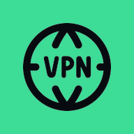

# MasterDnsVPN — Android Client

A native Android VPN client for the [MasterDnsVPN](https://github.com/masterking32/MasterDnsVPN)
DNS tunnel. It carries **all device traffic** through the tunnel using Android's
`VpnService`, with a small dark, minimal UI.

<p align="center">
  
</p>

## How it works

```
 Android apps ──► TUN (VpnService) ──► tun2socks ──► SOCKS5 (Go core)
                        │                                 │
                    DNS :53 ──► resolved directly ──► Yandex DNS (protected socket)
                                                          │
                                              TCP through the DNS tunnel ──► your VPS
```

The Go client + tun2socks are compiled into a single native library
(`mobile.aar`) via gomobile. The Kotlin app establishes the TUN interface and
hands its fd to the Go core. DNS is resolved directly via public resolvers
(Yandex by default) over a VPN-protected socket, which is fast and robust across
devices.

---

## 📥 Install the app

Grab the latest **`app-release.apk`** from the
[Releases](../../releases) page and install it on your phone
(allow *install from unknown sources*). On first **Connect**, accept the system
VPN dialog.

> Prefer to build it yourself? See [Build from source](#-build-from-source) below.

You still need a **server** (next section) and the **config** to paste into the app.

---

## 🖥️ Set up the server (VPS)

A DNS tunnel needs a server on a VPS **and** a domain whose DNS is delegated to
that VPS.

### 1. Point a subdomain's NS at your VPS

In your domain's DNS panel (Cloudflare, etc.), create these records — all as
**DNS only** (grey cloud, *not* proxied):

| Name              | Type | Value             |
| ----------------- | ---- | ----------------- |
| `ns.example.com`  | A    | `<YOUR_VPS_IP>`   |
| `t.example.com`   | NS   | `ns.example.com`  |

This delegates everything under `t.example.com` to your VPS. `t.example.com` is
your **tunnel domain**. (Wait a few minutes for propagation.)

> ⚠️ If your DNS provider offers "proxy"/CDN, keep these records **DNS only** —
> a proxied record hides port 53 and the tunnel won't work.

### 2. Install the server

SSH into the VPS and run the official installer:

```bash
bash <(curl -Ls https://raw.githubusercontent.com/masterking32/MasterDnsVPN/main/server_linux_install.sh)
```

- When asked for the domain, enter your tunnel domain (e.g. `t.example.com`).
- It frees port 53 (disables `systemd-resolved` stub), opens the firewall,
  installs a `systemd` service, and prints your **encryption key**.

Useful commands:

```bash
systemctl status masterdnsvpn
journalctl -u masterdnsvpn -f      # live logs
```

### 3. Encryption key

The installer generates a key automatically and stores it in
`/root/encrypt_key.txt`. To use your own (recommended for real use):

```bash
openssl rand -hex 32 > /root/encrypt_key.txt         # new random key
sed -i 's/^DATA_ENCRYPTION_METHOD = .*/DATA_ENCRYPTION_METHOD = 2/' /root/server_config.toml  # ChaCha20
systemctl restart masterdnsvpn
```

`DATA_ENCRYPTION_METHOD`: `0`=None `1`=XOR `2`=ChaCha20 `3`=AES-128-GCM
`4`=AES-192-GCM `5`=AES-256-GCM. **This number and the key must match the app.**

### 4. Verify

```bash
dig +short test.t.example.com @<YOUR_VPS_IP>
```

A response (not `connection refused`) means the server is listening and
delegation works.

---

## 📱 Configure the app

The app has two fields.

### Config (base64 JSON)

Build a JSON config with your tunnel domain, method and key, then base64-encode
it:

```bash
KEY=$(cat /root/encrypt_key.txt)   # or your key
printf '%s' "{\"DOMAINS\":[\"t.example.com\"],\"DATA_ENCRYPTION_METHOD\":2,\"ENCRYPTION_KEY\":\"$KEY\"}" | base64 -w0
```

Paste the resulting string into the **Config** field.

### Resolvers (DNS lists)

Public DNS resolvers the tunnel sends its queries *through*. They are stored as
named DNS lists: open **Manage DNS lists** to create, rename, activate or delete
lists, and use **Scan public DNS** to test candidates downloaded from
[public-dns.info](https://public-dns.info) and
[publicdnsserver.com](https://publicdnsserver.com) against your server using the
real tunnel protocol. Lists from both providers are merged and de-duplicated.
The merged list is cached gzip-compressed on the device so scanning still works
when the providers are unavailable. A **Default** list pre-filled with
**Yandex DNS** is created on first run:

```
77.88.8.8:53
77.88.8.1:53
```

Then tap **Connect**.

> Tip: on the phone, set **Settings → Private DNS → Off** (or *Automatic*). A
> fixed Private DNS hostname sends DNS over TLS and breaks resolution.

---

## 🔨 Build from source

Requires JDK 17+, Go 1.25+, Android SDK + NDK. Full toolchain setup (no Android
Studio needed) is in [`android/README.md`](android/README.md).

```bash
# 1) native library
export ANDROID_HOME=$HOME/Android/Sdk
export ANDROID_NDK_HOME=$ANDROID_HOME/ndk/<version>
./scripts/build-android-aar.sh          # -> android/app/libs/mobile.aar

# 2) debug APK (auto-signed, for yourself)
cd android
./gradlew assembleDebug                  # -> app/build/outputs/apk/debug/app-debug.apk
```

### Signed release APK (to share)

```bash
keytool -genkey -v -keystore ~/masterdns.jks -keyalg RSA -keysize 2048 \
  -validity 10000 -alias masterdns
cp android/keystore.properties.example android/keystore.properties   # fill in
cd android && ./gradlew assembleRelease  # -> app/build/outputs/apk/release/app-release.apk
```

Keep your `.jks` and `keystore.properties` out of git (already in `.gitignore`).
Upload `app-release.apk` to a GitHub **Release** so others can download it.

---

## Credits & license

Built on top of [masterking32/MasterDnsVPN](https://github.com/masterking32/MasterDnsVPN)
(the Go DNS-tunnel core) and [xjasonlyu/tun2socks](https://github.com/xjasonlyu/tun2socks).
The original project's README is preserved as [`UPSTREAM.md`](UPSTREAM.md).
See [`LICENSE`](LICENSE).
